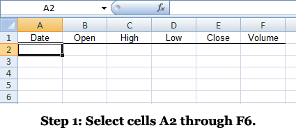

Frequently Asked Questions
==========================

**<a name="array_formulas">How do I get multiple values from FinAnSu functions?</a>**  
Many functions, particularly import functions, require the use of
array formulas. Microsoft has a good, long-form [explanation of array
formulas](http://office.microsoft.com/en-us/excel-help/introducing-array-formula
s-in-excel-HA001087290.aspx) that I recommend consulting if you'd like more
information. Many (most?) Excel users never receive exposure to array formulas,
but they are immensely useful for complex calculations.

Instead of returning a single value, some complex Excel functions are capable
of returning _multiple values_ to _multiple cells_. This helps save a lot of
processor time as you only calculate the results once, and FinAnSu uses it for
several functions. For example, instead of pulling data from Google Finance to
calculate one date, then doing the same and calculating the opening price, then
repeating for every day you specify, FinAnSu downloads the necessary information
once, parses it, and outputs all results to a range of cells.

Using these formulas requires a slightly different input method. First, you
select the cells you want the formula to apply to, then you type the formula,
and then you hit `Ctrl+Shift+Enter`.

Consider this example using [GoogleHistory](Quotes#GoogleHistory):

  1. **Select a range of cells**, for example cells `A1` through `F5`.
  2. **Type your formula.** In this case you would type something like
     `=GoogleHistory("GOOG")`.
  3. **Hold down `Ctrl+Shift` and hit `Enter`* _(note: without
     `Ctrl+Shift+Enter` it will just be a normal formula that for
     `GoogleHistory` just returns the most recent business day)_.
  4. This should return the most recent five business days of price data
     for [GOOG](http://www.google.com/finance?q=GOOG), which includes date,
     open, high, low, close and volume. You can verify the numbers by looking at
     [http://www.google.com/finance/historical?q=NASDAQ:GOOG](http://www.google.com/finance/historical?q=NASDAQ:GOOG).
     Also, the formula in your formula bar should appear as follows (note the curly braces):

     {=GoogleHistory("GOOG")}

---

**How do I [do such-and-such] ?**  
First, try using the function wizard in Excel. All functions have descriptions
of what values they return and accept. That is, type something like `=Quote(` in
a cell in Excel, then hit the _fx_ key just above the worksheet (or
press `Ctrl+A`).

If that's confusing, check the documentation here and the [Examples
worksheet](http://finansu.googlecode.com/hg/FinAnSu/Examples.xls).

If none of that helps or if you have any questions or suggestions for clarity,
go ahead and email me. My contact information is [below](#Contact_Information).

---

**How long will you support this?**  
Indefinitely but not always immediately. I developed this add-in in my spare
time to address a real professional need, and I use it frequently. That said,
there are two reasons for a loss of functionality in the quote import functions
specifically, neither of which I control:

  * *Temporary:* Bloomberg, Google or Yahoo! change the setup of their website
    such that I have to change how I parse data from them. This is extremely
    rare; I anticipate it happening maybe once every few years. When it does, it
    may take a _brief_ while before I notice and update the program.

  * *Permanent:* Bloomberg, Google or Yahoo! stop publishing financial data
    publicly. That said, if you change the `source` parameter for functions
    like [Quote](Quotes#Quote) or [QuoteHistory](QuoteHistory#QuoteHistory),
    very often you can find an alternate source. Of course,
    losing _all three_ of them would be a devastating [Black
    Swan](http://en.wikipedia.org/wiki/Black_swan_theory). You know, one
    of those "once-in-a-million-years" events (i.e. a truly unpredictable
    misfortune for which we assume a ridiculously optimistic probability of
    avoidance).

There may also be some disruptions in different Excel or .NET versions, but I
_think_ they will be minimal.

---

**Why is [Quote](Quotes#Quote) or [QuoteHistory](Quotes#QuoteHistory) only returning one value?**  
See [the section on array formulas](ArrayFormulas).

---

**Can I use this at work, on other computer, etc.?**  
Hopefully. I'm unfamiliar with the access restrictions at different companies,
but in general if you meet the [minimum requirements](#Requirements) you
should be fine. If there are real access limitations, feel free to [inform
me](#Contact_Information), but I don't know how much I can do about it.

Also, this application does _not_ transmit any usage data to me or even connect
to any servers owned by me. Feedback is always appreciated, but I'm not
collecting it behind the scenes.

---

**What do I do if I notice an error?**  
Either [email me](#Contact_Information) or [enter a new
issue](https://github.com/brymck/finansu/issues/new).
