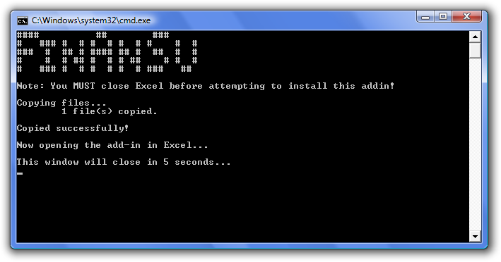
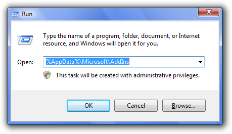

System Requirements
===================

  * [Microsoft Excel for Windows](http://office.microsoft.com/excel/)
  * [Microsoft .NET Framework 4](http://www.microsoft.com/downloads/details.aspx?FamilyID=9cfb2d51-5ff4-4491-b0e5-b386f32c0992)
  * The ability to install add-ins. There shouldn't be any problems unless
    macro security is set to high or you have a _very_ restrictive policy regarding
    writing to your `%AppData%` folder.

Installation
============

  1. Close Excel.
  2. Download the [latest zip file from the Downloads section of this
     repository](https://github.com/brymck/finansu/downloads).
  3. Unzip the files to a safe location.
  4. There are two ways to install FinAnSu: the automatic way that uses the
     installation batch file, or a simple copy-and-paste of the .xll file into
     the appropriate directory.
     * **Automatic:** Run `install.bat` (closing Excel if prompted).
       
     * **Manual:** Copy `FinAnSu.xll` to `%AppData%\Microsoft\AddIns`. _(Note: You
       can type that into the `Start Menu > Run...` window or the location bar
       of any Folder Explorer window.)_
       
  5. If this is your first install, open Excel and do the following:
     * **Excel 2007 and later**
       * Click `Office Button > Excel Options... > Add-Ins`.
       * In the `Manage:` drop-down at the bottom, click `Excel Add-ins` and
         `Go...` .
       * Place a checkmark next to FinAnSu.
     * **Excel 2003 and earlier**
       * Go to `Tools > Add-Ins`.
       * Place a checkmark next to FinAnSu.
  6. If you want to check the installation, open the `Examples.xls` spreadsheet.
     If the functions are returning values, you're all set!
