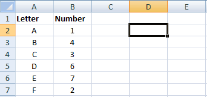

<a name="sorting">Sorting</a>
=============================

_Note: Before proceeding, please read the section on [array
formulas](faq#array_formulas) if you are unfamiliar with their usage._

AutoSort
--------

Automatically sorts an array in Excel when the range it refers to is updated.


=AutoSort(range, index, sort_vertical, sort_ascending)

' Returns an array of values based on cells A1:B3, sorted by the second column
=AutoSort(A1:B3, 2)


  * `range` is a list of cells to monitor for changes in value.
  * `index` is the index of the row of column you wish to sort on. Defaults to
    `1`.
  * `sort_vertical` is whether you wish to sort based on vertical data. Defaults
    to `TRUE`.
  * `sort_ascending` is whether you wish to sort in ascending or alphabetical
    order. Defaults to `TRUE`.

_(Note: After filling out the formula as shown below, press `Ctrl+Shift+Enter`
instead of `Enter`. This will create an array formula that applies to all
selected cells.)_

Color
=====

These functions are designed to aid in the development of themes, just because
I got tired of converting hexadecimal colors using online tools. It supports
the conversion of [hexadecimal](http://en.wikipedia.org/wiki/Web_colors),
[RGB](http://en.wikipedia.org/wiki/RGB_color_model) and
[HSV](http://en.wikipedia.org/wiki/HSL_and_HSV) colors between each other.

RGBToHex
--------

Converts an RGB color to hexadecimal format.


=RGBToHex(red, green, blue)

' Returns "#8ebae5"
=RGBToHex(142, 186, 229)


  * `red` is the level of red in the color (0‒255).
  * `green` is the level of green in the color (0‒255).
  * `blue` is the level of blue in the color (0‒255).

RGBToHSV
--------

Converts an RGB color to HSV format.


=RGBToHSV(red, green, blue, flag)

' Returns {209.7, 0.38, 0.90}
=RGBToHSV(142, 186, 229)     

' Returns 209.7
=RGBToHSV(142, 186, 229, "h")


  * `red` is the level of red in the color (0‒255).
  * `green` is the level of green in the color (0‒255).
  * `blue` is the level of blue in the color (0‒255).
  * `flag` is text describing which HSV value you are requesting. Defaults to a
    horizontal array containing all three.

HexToRGB
--------

Converts a hexadecimal color to RGB format.


=HexToRGB(hex, flag)

' Returns {142, 186, 229}
=HexToRGB("#8ebae5")     

' Returns 142
=HexToRGB("#8ebae5", "r")


  * `hex` is the color in three- or six-digit hexadecimal format.
  * `flag` is text describing which RGB value you are requesting. Defaults to a
    horizontal array containing all three.

HexToHSV
--------

Converts a hexadecimal color to HSV format.


=HexToHSV(hex, flag)

' Returns {209.7, 0.38, 0.90}
=HexToHSV("#8ebae5")       

' Returns 0.38
=HexToHSV("#8ebae5", "sat")


  * `hex` is the color in three- or six-digit hexadecimal format.
  * `flag` is text describing which RGB value you are requesting. Defaults to a
    horizontal array containing all three.

HSVToRGB
--------

Converts an HSV color to RGB format.


=HSVToRGB(hue, saturation, value, flag)

' Returns {142, 186, 229}
=HSVToRGB(209.6, 0.379, 0.899)         

' Returns 186
=HSVToRGB(209.6, 0.379, 0.899, "green")


  * `hue` is the level of hue in the color (0‒100%).
  * `saturation` is the level of saturation in the color (0‒100%).
  * `value` is the level of value (or brightness) in the color (0‒360).
  * `flag` is text describing which RGB value you are requesting. Defaults to a
    horizontal array containing all three.

HSVToHex
--------

Converts an HSV color to hexadecimal format.


=HSVToRGB(hue, saturation, value)

' Returns "#8ebae5"
=HSVToRGB(209.6, 0.379, 0.899)


  * `hue` is the level of hue in the color (0‒100%).
  * `saturation` is the level of saturation in the color (0‒100%).
  * `value` is the level of value (or brightness) in the color (0‒360).

Version Information
===================

LatestVersion
-------------

Retrieves the version number for the latest version of FinAnSu available on the
[project home page](https://github.com/brymck/finansu).


' Returns a version number such as "1.0.1"
=LatestVersion()


CurrentVersion
--------------

Returns the currently installed version number for FinAnSu.


' Returns a version number such as "1.0.1"
=CurrentVersion()


UpdateAvailable
---------------

Returns whether an update exists for FinAnSu.


' Returns TRUE or FALSE
=UpdateAvailable()

